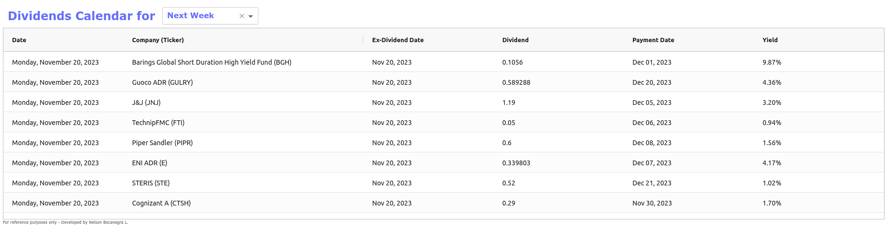
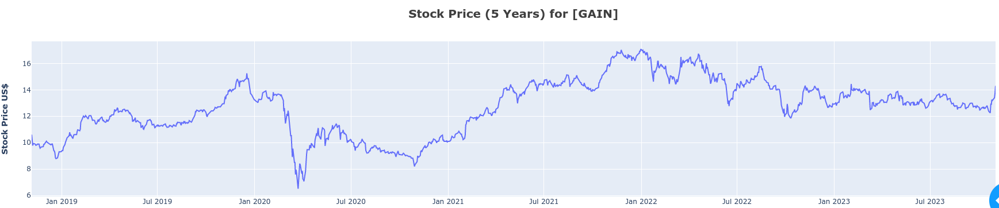
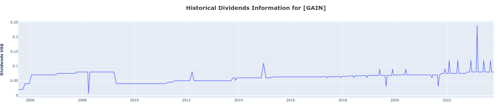
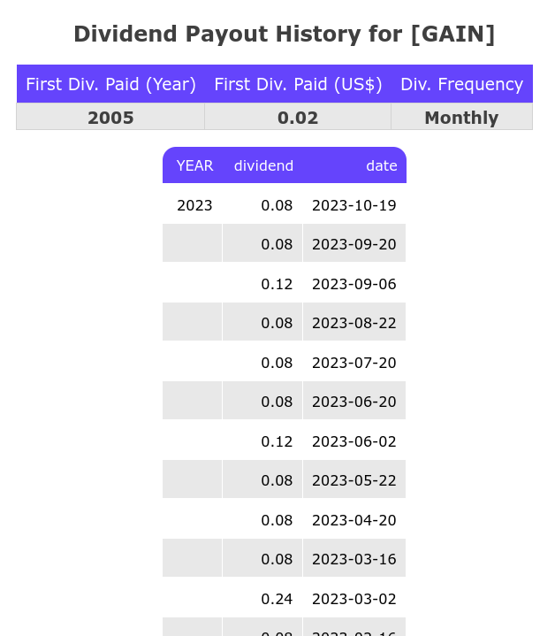

Dividends Information & Analysis for a given Period
===

What companies are about to pay dividends? 
Sometimes we need to clear up this doubt. But in addition, we need to get vital information about the company: its current 
position and historical behavior in the stock market. And it is also necessary to know their history of dividend 
payments: since when have they been paid? is the percentage increasing or decreasing?, perhaps is it constant?, 
what is the frequency?

This app helps answer these questions quickly. It shows the list of companies that will pay dividends in a certain 
period of your choice. You can choose between `next week`, `this week` or `tomorrow`.  Information that will be seen 
here: Company Name, Dividend, Payment Date, etc.



By selecting a company, related information will be displayed in the graphs and tables located below.
- Stock Price for the last 5 years:
   
- Historical Dividends information:
  
- Dividend Payout History in summary and table format.
   


This app uses the `yahoo_fin` library to obtain most of the information and an investing.com public API is also used 
for building first grid. This app saves information gathered on csv files and does not request for new 
information according to configuration saved in `general.conf`:
    
```
   [TIME_DELTA_DAYS]
   HISTORICAL_DATA=1
   DIVIDENDS=80
```
This is expressed in days. HISTORICAL_DATA is to build stock prices (for the purpose of this app 1 day old is enough) 
and DIVIDENDS is to obtain information for dividends. Since most dividends are paid quarterly, 80 days old info is enough.  

The default market is USA, but you can also configure this. Some example values:

| Country   | Value |
|-----------|-------|
| USA       | 5     |
| ARGENTINA | 29    |
| BRAZIL    | 32    |
| CHINA     | 37    |

Just replace any of these integer value in `general.conf` file, section `INVESTING`:
```
    [INVESTING]
    COUNTRY=5
```


How to use it
---
1. Install requirements: ```pip3 install -r requirements.txt```
2. Run app.py: ```python3 app.py``` or ```py app.py``` 
3. Open a browser and go to: http://127.0.0.1:8050/
4. Click on any of the tickers or companies of grid. Information related is shown below.
   
Important
---
* Make sure to delete frequently csv files generated on csv_files directory.
* Any suggestion for improvement will be welcome. 

